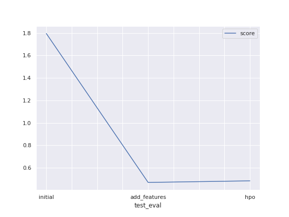

# Report: Predict Bike Sharing Demand with AutoGluon Solution
#### ANKIT KUMAR PREM

## Initial Training
### What did you realize when you tried to submit your predictions? What changes were needed to the output of the predictor to submit your results?
When I tried to submit the result, at first I got error on kaggle. It happened because there can't be any negative no. of count, it doesn't make sense. So I changed all the negative values to zero.
Change neede - [negative values ---> zero]

### What was the top ranked model that performed?
WeightedEnsemble_L3

## Exploratory data analysis and feature creation
### What did the exploratory analysis find and how did you add additional features?
Findings from EDA:
- temperature was normally distributed (bell-curve)
- humidity : left skewed, wind speed, casual, registered, count : right skewed
Additional features added by me - I splitted the datetime column into 4 columns: year, month, day, hour

### How much better did your model preform after adding additional features and why do you think that is?
The performance of the model was significantly improved from a kaggle score of 1.79566 to 0.46986. The improvement was because of the feature addition.

## Hyper parameter tuning
### How much better did your model preform after trying different hyper parameters?
The model performed much better than the initial model but a little bit worse than the improvement with just the features. I followed the suggested hyperparameter improvement for tabular data provided by autogluon but did not manage to figure out how to additionally tune the parameters in order to improve the result. More background information is needed to fine-tune the model.

### If you were given more time with this dataset, where do you think you would spend more time?
If I were given more time to spend with the dataset, I would spen some time with hyperparameter tuning, and also with feature engineering.

### Create a table with the models you ran, the hyperparameters modified, and the kaggle score.
|model|time_limit|presets|model specific|score|
|--|--|--|--|--|
|initial||600|best_quality|None|1.79566|
|add_features|600|best_quality|None|0.46986|
|hpo|600|best_quality|num_boost_round (for lightGBM gradient boosted trees)|0.48397|

### Create a line plot showing the top model score for the three (or more) training runs during the project.

![model_train_score (1).png]

### Create a line plot showing the top kaggle score for the three (or more) prediction submissions during the project.

## Summary
The most benefit is received by working with the features and you can gain great insights from the EDA. But spending some time with hyperparameter tuning may also give good result. But for this I need to know the algorithms details, like what should I make change to a model so that it perform well.
Working forward my goal would be to improve the model by tuning the hyperparameters and also gaining insights from EDA.
